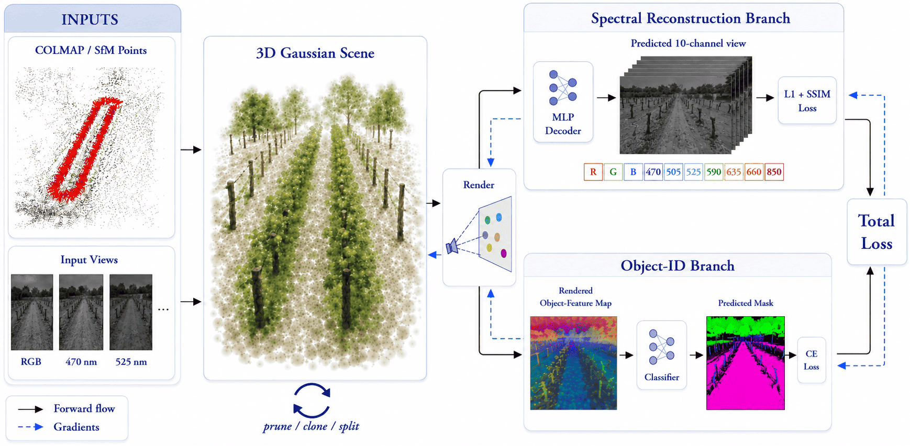
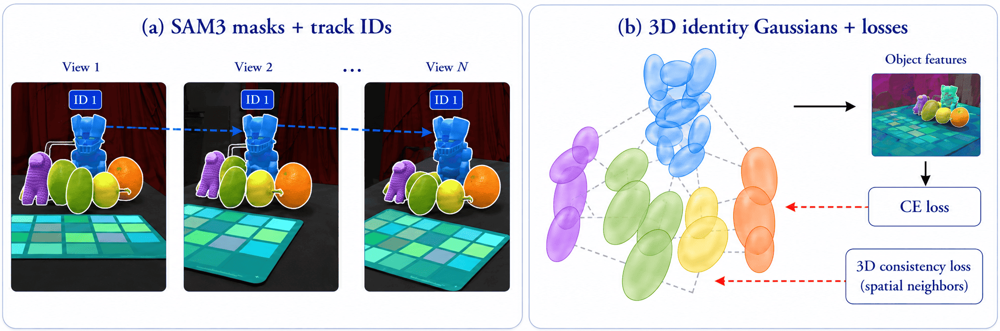
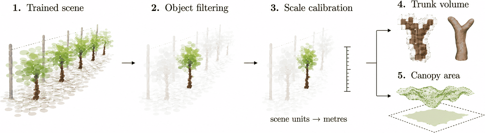

# Instance-Aware Multispectral 3D Gaussian Splatting for Vineyards

This repository contains the implementation developed for the TFG **Instance-Aware Multispectral Representation of Vineyards with 3D Gaussian Splatting**. The project adapts [Gaussian Grouping](https://github.com/lkeab/gaussian-grouping) to vineyard scenes acquired with RGB and narrow-band multispectral imagery, with the goal of learning a shared 3D Gaussian representation that combines geometry, appearance, spectral information, and object-level structure.

The method extends the original pipeline with:

- learned per-Gaussian RGB and multispectral appearance;
- partial-channel supervision for images that observe only part of the spectrum;
- class-aware object features supervised with tracked SAM 3 masks;
- RGB, multispectral, and object-label rendering from novel viewpoints; and
- plant-level extraction for approximate trunk-volume and canopy-area measurements.

The complete workflow is:

```text
dataset preparation -> COLMAP/camera setup -> SAM 3 masks -> training -> rendering/evaluation -> plant measurements
```

<p align="center">
  
</p>

> **Scope.** The plant measurements are feasibility-study estimates, not validated agronomic ground truth. They depend on camera registration, mask quality, scale calibration, Gaussian density thresholds, object selection, and reconstruction completeness.

## Method Overview

Each Gaussian stores geometry, opacity, a learned appearance embedding, and an object feature. A small decoder maps the appearance embedding to RGB and narrow-band channels, while a classifier maps rendered object features to class-aware instance predictions.

During training, the photometric loss is evaluated only on the channels available for the current view. RGB images supervise the RGB channels, while each narrow-band image supervises only its corresponding spectral band. This makes it possible to train a single 3D Gaussian scene from separately acquired RGB and multispectral sequences.

The vineyard model predicts ten appearance channels:

```text
R, G, B, 470, 505, 525, 590, 635, 660, 850 nm
```

Object supervision is provided by tracked SAM 3 masks. These masks transfer class-aware instance information from 2D views into the 3D Gaussian representation, allowing components such as trunks, canopy, ground, and support structures to be selected directly in 3D.

<p align="center">
  
</p>

After training, the model can render RGB views, individual narrow-band views, full multispectral outputs, and object-label predictions from novel viewpoints. Object predictions can also be applied directly at the Gaussian level, which makes it possible to isolate plant components in 3D and use them for approximate geometric measurements.

<p align="center">
  
</p>

## Main Results

The project evaluates the method on controlled RGB and multispectral scenes, as well as on real vineyard acquisitions from three dates. Controlled experiments show that partial-channel training is feasible, although it is more difficult than full-channel supervision.

On the corrected `vines_20260509` object-prediction evaluation, the full RGB+MS configuration obtained the best results among the compared settings:

```text
Instance mIoU:      0.470
Instance Dice/F1:   0.649
Class mIoU:         0.719
Class Dice/F1:      0.816
```

These results suggest that RGB and multispectral supervision provide complementary information for object-aware Gaussian representations. The improvement should be interpreted as moderate rather than definitive, because the corrected evaluation subset is limited.

## Installation

```bash
conda create -n gaussian_grouping python=3.8 -y
conda activate gaussian_grouping

conda install pytorch==1.12.1 torchvision==0.13.1 \
  torchaudio==0.12.1 cudatoolkit=11.3 -c pytorch

pip install -r requirements.txt
pip install submodules/diff-gaussian-rasterization
pip install submodules/simple-knn
```

See [installation](docs/installation.md) for CUDA-extension, COLMAP, and SAM 3 setup notes.

## Quick Start

### Bear RGB

Download Bear from the [Gaussian Grouping data repository](https://huggingface.co/mqye/Gaussian-Grouping/tree/main/data), place it at `data/bear`, then run:

```bash
bash script/train.sh bear_rgb
```

### Basement multispectral

After preparing the scene at `data/basement`:

```bash
bash script/train.sh basement_all9
```

The Basement dataset was provided by **Arnau Marcos Almansa**.

### Vineyard RGB + multispectral

After preparing the vineyard scene and its camera/mask metadata:

```bash
bash script/train.sh vines_20260509_rgb_ms
```

The vineyard scenes were captured and provided by **Felipe Lumbreras Ruiz** in the context of the VINIA project.

### Render and evaluate

```bash
python render.py -m output/vines_20260509_rgb_ms \
  --iteration 30000 --skip_train --only_prefix rgb

python metrics.py -m output/vines_20260509_rgb_ms
```

Models, rendered images, and metrics are written below:

```text
output/<run-name>
```

Both `data/` and `output/` are intentionally ignored by Git.

## Documentation

- [Installation](docs/installation.md)
- [Data preparation](docs/data_preparation.md)
- [Training](docs/training.md)
- [SAM 3 masks](docs/sam3_masks.md)
- [Rendering and evaluation](docs/evaluation.md)

## Repository Structure

```text
|-- train.py, render.py, metrics.py     Core training, rendering, and evaluation entry points
|-- scene/                              Cameras, COLMAP readers, and Gaussian model definitions
|-- gaussian_renderer/                  Differentiable Gaussian renderer integration
|-- arguments/ and utils/               Configuration, losses, and shared utilities
|-- config/                             Training, SAM 3, and experiment configurations
|-- script/                             Reproducible training and experiment wrappers
|-- tools/                              Evaluation, mask-processing, and temporal utilities
|-- docs/                               User documentation and research notes
|-- submodules/                         CUDA rasterizer and nearest-neighbor extensions
|-- data/                               Local datasets, ignored by Git
|-- output/                             Trained models and rendered results, ignored by Git
```

## Notes on Plant Measurements

The trained object-aware Gaussian scene can be filtered by predicted class and instance to isolate selected plant components. This is used to estimate approximate trunk volumes and canopy surface areas after metric scale calibration.

The current implementation includes two types of geometric estimators:

- voxel or height-profile occupancy for trunk-volume estimation;
- marching-cubes and Poisson-style mesh reconstruction for canopy surface-area estimation.

These measurements are intended as research prototypes. They should be interpreted as approximate geometric descriptors of the reconstructed Gaussian scene, not as direct physical measurements of the plants.

## Author

Developed by **Joel Calm Padrosa** as a Bachelor’s Thesis project in the **Computational Mathematics and Data Analytics** degree at the **Universitat Autònoma de Barcelona (UAB)**, Bellaterra, June 2026.